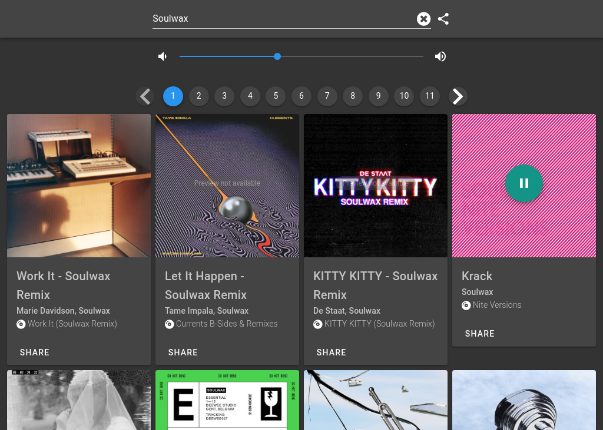

# Spotify track preview 

Web player to play the Spotify track preview.

Most songs on Spotify have a small track preview. This web application can be
used to search play and share the Spotify track preview.

> I do not own the images and other copyrighted material in the image above.
> The image above is a mere example of the possible outcome of the above displayed search query using the Spotify WEB API. The fact that I use the above displayed search query is only because I am a fan of the work of the above displayed artists.

## Accessing the application

This application is hosted using Github pages on [ingmar.dels.ink/spotify-track-preview](https://ingmar.dels.ink/spotify-track-preview/).

## Running it locally

1.  Clone the repository
2.  Install the dependencies using `npm install`
3.  Optionally, change the ClientID with your own ClientID in the `app-info.js` file.
   The ClientID is used for authentication against the Spotify Web API. See: [Authorization Guide](https://developer.spotify.com/documentation/general/guides/authorization-guide/)
4.  Start the live development server with `npm run serve`

## Thanks!

Thanks to all the maintainers of the packages used in this small application!

-   Spotify Web API using [spotify-web-api-js](https://github.com/JMPerez/spotify-web-api-js) with [Implicit Grant Authorization](https://developer.spotify.com/documentation/general/guides/authorization-guide/#implicit-grant-flow).
-   [Vue](https://vuejs.org/) + [Vuetify](https://vuetifyjs.com) for state management and User Interface design.
-   All the packages listed in the [package.json](./package.json) file.

## License

> You can check out the full license [here](./LICENSE)

This project is licensed under the terms of the **MIT** license.
